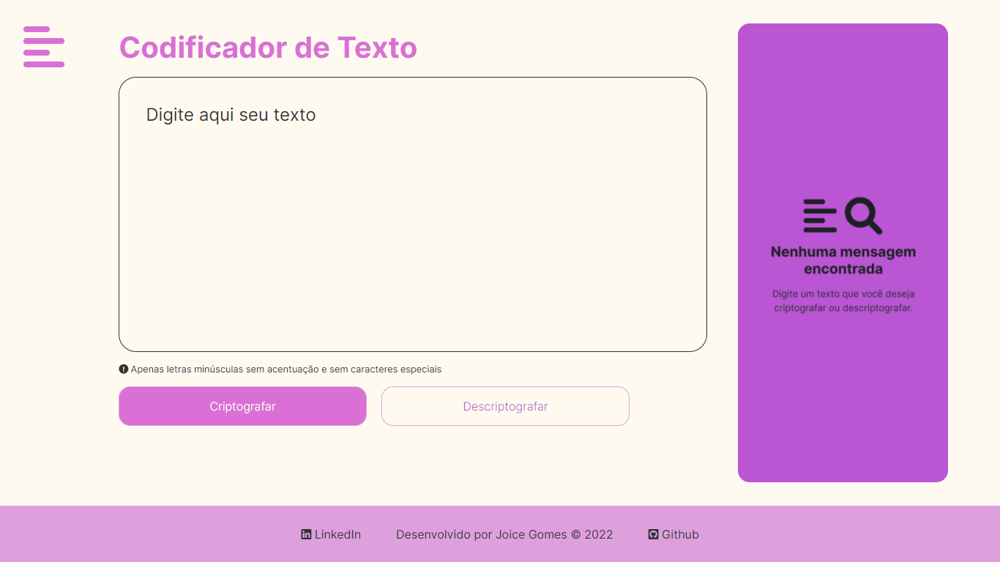

# Site Codificador/Decodificador de Texto

Projeto desenvolvido para o 1º Alura Challenge do programa Oracle Next Education | ONE.  

O challenge consiste em contruir um decodificador de texto com JavaScript.

## O que foi utilizado
Para estruturar o site foi utilizado HTML, para estilizar, CSS. E JavaScript foi utilizado para a parte interativa do site.

No script, utilizei formas de manipular o DOM para poder capturar o texto digitado pelo usuário, e retornar o texto criptografado ou descriptografado.  

Também para dar interatividade com os botões, utilizei eventos como onclick para disparar as funções de criptografar, descriptografar e copiar o texto.   

Para a lógica das funções, foi utilizado métodos dos arrays e strings, condicionais e estruturas de repetição.

## Responsividade
Em construção
